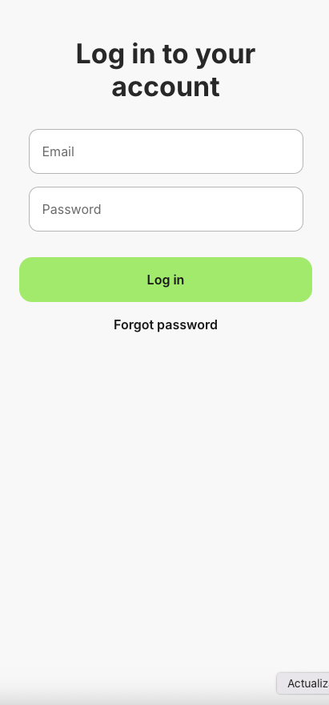
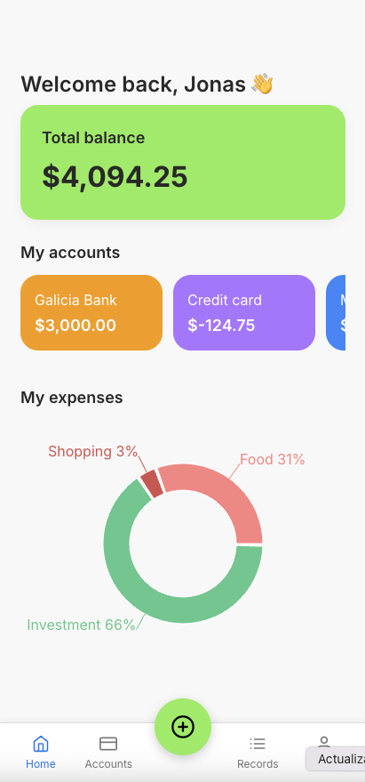
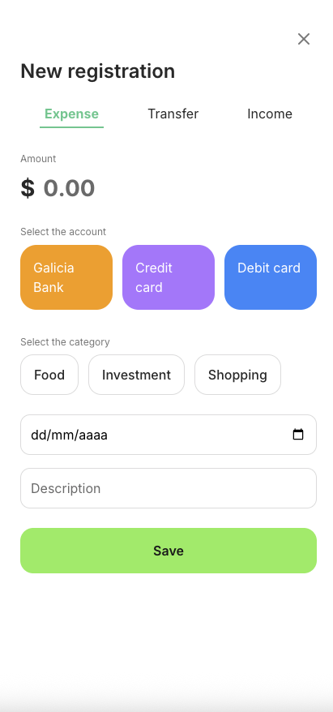

# My Money

## Context

This project, **My Money**, is my final assignment for the "Development of Interactive Systems" course in the Master's program. The goal was to design and implement a mobile application that empowers users to track their incomes, expenses, and transfers in a clear and visual way, promoting better financial awareness and savings habits.

## Features

- **Total Balance Overview:** See all your accounts and their combined balance at a glance.
- **Spending Categories:** Visualize your expenses by category with easy-to-understand charts.
- **Recent Activity:** Quickly review recent transactions and keep your finances up-to-date.
- **Add Transactions:** Register new incomes, expenses, or transfers with details like amount, date, category, and account.
- **User Profile:** Manage and view personal information.

## Screenshots

  
  
  

## Design & Development

- **Design:** The initial design was created in Figma, focusing on intuitive user flow and clean visual hierarchy. Key screens include:
  - Login
  - Dashboard
  - Accounts
  - Profile
  - Register Movement Form

- **Prototype:** The functional prototype was built using reusable front-end components:
  - Account cards
  - Navigation bar
  - Action buttons
  - Pie chart for expense distribution

- **Data:** The app uses simulated ("fake") data to demonstrate dynamic content and user interactions throughout the interface.

## Technologies Used

- **Figma** (UI/UX Design & Prototyping)
- **React** (Front-end development, component architecture)
- **JavaScript**
- **CSS Modules** / Styled Components (add your approach)
- **Chart.js** or similar (for visualizing data)
- [Any other libraries/plugins you used]

## What I Learned

Working on My Money helped me deepen my skills in front-end development, especially in building reusable React components and managing interface logic. Despite facing personal challenges, I enjoyed the process and learned a lot about designing user-centric mobile applications.

## Getting Started

1. **Clone the repository:**  
   `git clone https://github.com/your-username/my-money.git`
2. **Install dependencies:**  
   `npm install`
3. **Start the development server:**  
   `npm start`

> _This project uses fake data for demonstration purposes. No real financial data is handled._

## Acknowledgments

Thank you for your time and for reviewing my project! I hope you enjoy the presentation.  
If you have any feedback or suggestions, feel free to open an issue or contact me.

---

_My Money_ — Final Project for "Development of Interactive Systems"